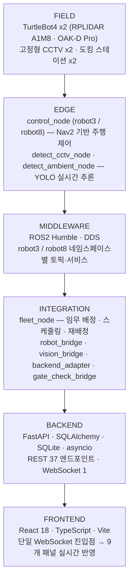
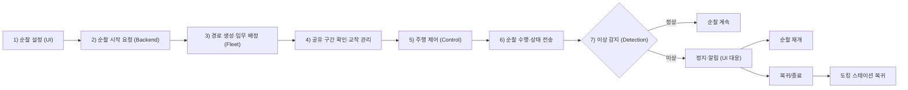

# 🤖 데이터센터 자율 순찰 시스템 (Multi-AMR Patrol · Anomaly Detection)

**팀 프로젝트명:** PATROL BOT
**팀명:** B-4 불사조 (김범준, 박채송, 정태성, 하찬용 외)

본 프로젝트는 **ROS2 Humble**과 **TurtleBot4(Create3) 2대**(`robot3`, `robot8`)를 기반으로 구동되는 데이터센터 자율 순찰 로봇 시스템입니다.
YOLO 기반 비전 인식으로 화재(fire)·냉각수 누출(coolant) 등 설비 이상을 실시간으로 판정하고, 다중 AMR의 순찰 경로를 자동 배분·충돌 회피하며, React 기반 관제 화면에서 로봇 상태·CCTV·이벤트 이력을 통합 모니터링합니다.

---

## 📌 주요 기능 (Key Features)

### 1. 다중 AMR 순찰 (Multi-AMR Patrol)
- **임무 배분:** `fleet_node`가 존-1(AMR-01/robot3 또는 robot8)·존-2 구역별 waypoint를 배정하고 순찰 진행 상태를 관리합니다.
- **경로 충돌·교착 방지:** 통로 그래프(route graph) 기반 최단 경로 계산과 공유 지점(point) `occupancy_request → grant(15초 타임아웃) → release` 프로토콜로 두 로봇의 동시 진입을 제어합니다. 교착 지점 발생 시 자동으로 교착 유도 경로를 배정합니다.
- **재배정 로직:** 위치 미확인 로봇 제외, 전원 미확인 시 후보 리스트 첫 로봇 선정 등 예외 상황을 처리합니다.
- **순찰 완료/재순찰:** 전 waypoint 통과 시 `mission_complete` 발행, 10분(`NEXT_PATROL_DELAY_SEC`) 대기 후 재순찰하며, 이상신호·긴급정지는 대기 중에도 즉시 반영됩니다.

### 2. 비전 기반 이상 감지 (Vision Detection)
- **탐지:** Webcam(CCTV) 및 TurtleBot4 OAK-D Pro 카메라 영상을 YOLOv8n(TTA)·YOLO11n·YOLO26 등 다중 모델 WBF(Weighted Box Fusion) 앙상블로 분석해 `fire`(화재)·`coolant`(냉각수 누출)를 감지합니다.
  - CCTV: `wbf_iou=0.70, conf=0.44` → Precision 0.875 / Recall 0.737 / F1 0.800
  - AMR Cam: `wbf_iou=0.45, conf=0.21` → Precision 1.000 / Recall 0.972 / F1 0.986
- **설비 상태 판독:** Hough Transform·HSV 색상 검출 기반으로 차단기 개폐 상태를 추출하고, 설비 DB 값과 비교해 일치(0)/불일치(1)/미검출(2)/카메라 오류(3)로 분류합니다.
- **감지/해제 디바운스:** 오탐·오해제 억제를 위해 프레임 단위로 지속성을 요구합니다.
  - 진입(미탐지 위험): CCTV 연속 5프레임 검출 / AMR 최근 5프레임 중 3프레임 검출
  - 해제(오해제 위험): CCTV 연속 7프레임 미검출 / AMR 연속 5프레임 미검출

### 3. 이상 징후 추적 및 알림 (Anomaly Tracking)
- 이상 감지 시 `/detection/cam_state`(CamState.msg)로 상태를 발행하고 로봇 이동을 즉시 정지시킵니다.
- 사람/가방(유실물) 등 부가 객체 감지 시 우선순위에 따라 접근(Approach) 또는 좌측 우선 탐색(Left-First Search)으로 대응합니다.
- 비상정지(`/fleet/<ns>/emergency_stop`) 수신 시 콜백에서는 플래그만 세팅하고 이동 루프가 0.1초 간격으로 확인 후 취소하여 재진입 행(hang)을 방지합니다.

### 4. 실시간 관제 (System Monitoring)
- **관제 화면 구성:** 상단 제어 영역 · 좌측 AMR 상태(순찰 미션) · 중앙 시설 맵/실시간 모니터링 · CCTV 영상 · 우측 이상 감지 현황/이벤트 큐/활동 로그로 구성 (React 18 + TypeScript + Vite, 9개 패널).
- **실시간 연동:** 단일 WebSocket(`/ws/monitor`)으로 로봇 상태·이벤트·CCTV 이미지를 브로드캐스트하며, 메시지 형식은 `{type, timestamp, payload}`입니다. 텔레메트리 큐(2000, 드롭 허용)와 이벤트 큐(500, 드롭 금지)를 분리해 화재·연기 이벤트는 절대 유실되지 않도록 설계했습니다.
- **이벤트 이력:** Detection 이벤트와 관제 명령을 SQLite(`tb_events`)에 저장해 이력 조회를 지원합니다.
- **사용자 제어:** 통합 순찰 시작, 도킹 스테이션 복귀, 개별/전체 긴급정지 등을 REST API(37개 엔드포인트)로 Backend에 전달합니다.

---

## 🛠 시스템 설계 (System Architecture)

### 전체 구조 (Layered Architecture)



| 영역 | 역할 | 주요 구성 |
| --- | --- | --- |
| Detection | 영상 기반 설비 상태 및 이상 상황 판정 | Webcam, OAK-D-Pro, YOLO, Python |
| System Monitoring | 로봇 상태·지도·이벤트 관제 및 이력 관리 | React, Uvicorn/FastAPI, SQLite |
| AMR Control / Navigation | 다중 AMR 임무 배분, 충돌 회피, 순찰 및 주행 | ROS2, Python, TurtleBot4, RPLIDAR A1M8 |

### 주요 노드 (Node Architecture)

| 그룹 | 노드 | 역할 |
| --- | --- | --- |
| Fleet | `fleet_node` | 다중 AMR 임무 배정 · 경로 스케줄링 · 충돌/교착 방지 · 재배정 |
| Fleet | `gate_check_bridge` | 공유 구간(교차로) 점유 확인 및 통행 조율 |
| HMI/Backend | `backend_adapter` | ROS2 상태·명령을 Backend와 실시간 연계 |
| Control | `control_node` (robot3 / robot8) | Nav2 기반 목표점 주행 · 장애물 회피 · 정지/복귀, 상태·배터리 리포트 |
| Detection | `detect_cctv_node` · `detect_ambient_node` | 카메라 영상 YOLO 실시간 추론(WBF 병합) |
| Detection | `detect_main_node` · `detect_station_node` | conf/iou 임계값 검증 + 디바운스, CheckGate 서비스 |
| HMI/Backend | `robot_bridge` · `vision_bridge` | ROS2 토픽·이미지를 Backend/HMI로 중계 |

### 알고리즘 플로우 차트 (Logic Flow)



### 순찰 waypoint 데이터 형식

```
x, y, yaw / point_id / has_gate / gate_yaw
```

### 주요 ROS2 Topic / Service / Action

- **Sub:** `/fleet/<ns>/mission`, `/fleet/<ns>/route_update_response`, `/fleet/<ns>/gate_check_response`, `/occupancy_grant`, `/anomaly`, `/anomaly_resume`, `/anomaly_captured`, `/emergency_stop`, `/dock`, `/scan`, `/amcl_pose`
- **Pub:** `/fleet/<ns>/mission_complete`, `/fleet/<ns>/request_next_mission`, `/occupancy_request`, `/occupancy_release`, `/anomaly_done`, `/control/<ns>_state`, `/waypoint_reached`, `/failure`, `/battery_state`, `/collision_risk`, `/navigation_recovery`, `/gate_check_request`, `/route_update_request`, `/mission_reject`
- **Action:** Nav2 `NavigateToPose` / `Spin`, TurtleBot4 `Dock` / `Undock`
- **Detection:** `/detection/cam_state` (CamState.msg)

---

## 🖥 개발 환경 (Environment)

| 항목 | 내용 |
| --- | --- |
| OS | Ubuntu 22.04 LTS (Jammy Jellyfish) |
| Middleware | ROS 2 Humble Hawksbill (Discovery Server 모드, 실물 로봇 네트워크 연동) |
| Language | Python 3.10 |
| Frontend | React 18, TypeScript, Vite |
| Backend | FastAPI, SQLAlchemy, SQLite, Uvicorn, asyncio |
| Detection | YOLOv8 / YOLO11 / YOLO26 (Ultralytics), OpenCV, WBF(Weighted Box Fusion) |
| Navigation | Nav2 (map_server, amcl, bt_navigator, planner_server, controller_server, behavior_server, smoother_server, velocity_smoother) |
| Key Libraries | `rclpy`, `nav2_simple_commander`, `ultralytics`, `cv_bridge`, `opencv-python`, `numpy` |

---

## ⚙️ 사용 장비 (Hardware Setup)

| 구성 요소 | 수량 | 비고 |
| --- | --- | --- |
| TurtleBot4 (Create® 3 Base) | 2대 (`robot3`, `robot8`) | 이동 플랫폼, Raspberry Pi 4B에서 로봇 소프트웨어 실행 |
| RPLIDAR A1M8 | 로봇별 1개 | 360도 LiDAR, Navigation 및 충돌 회피용 |
| OAK-D Pro Camera | 로봇별 1개 | AMR 비전(영상 판정) 입력 |
| TurtleBot4 Docking Station | 2개 | 로봇별 도킹/복귀 지점 |
| Webcam (CCTV) | 2대 | 존-1 / 존-2 고정형 설비 감시 영상 입력 |
| 관제/제어용 PC (MSI, Ubuntu 22.04) | 2대 | PC1(Host): Detection·Fleet·AMR Control/Navigation<br>PC2(Client): 관제 UI·Backend·이벤트 이력 |

| Component | Type | Topic / Spec |
| --- | --- | --- |
| Robot | Create 3 (TurtleBot4) | Differential Drive Robot |
| Vision (AMR) | OAK-D Pro | AMR 카메라 영상 |
| Vision (CCTV) | Webcam | 존별 고정형 CCTV 영상 |
| Lidar | RPLIDAR A1M8 | `/scan` |
| Odom | Wheel Odometry (Create 3) | `/amcl_pose` |

---

## 📦 의존성 설치 (Installation)

### 1. ROS2 / TurtleBot4 환경
사전에 각 PC 및 로봇 온보드에 ROS2 Humble, TurtleBot4 패키지, Discovery Server 설정(`/etc/turtlebot4_discovery/setup.bash`)이 구성되어 있어야 합니다.

```bash
sudo apt update
sudo apt install ros-humble-navigation2 ros-humble-nav2-bringup \
                  ros-humble-turtlebot4-navigation ros-humble-turtlebot4-viz \
                  ros-humble-cv-bridge
```

### 2. Python 필수 라이브러리 (`requirements.txt`)
YOLO 구동, 이미지 처리, Backend 실행을 위한 패키지입니다.

```bash
pip install ultralytics opencv-python numpy fastapi uvicorn sqlalchemy
# 또는
pip install -r requirements.txt
```

### 3. ROS2 워크스페이스 빌드

```bash
cd ~/Desktop/DBcenter-PT-Bot
colcon build --symlink-install
source install/setup.bash
```

### 4. 관제 프론트엔드 설치

```bash
cd ~/Desktop/DBcenter-PT-Bot/hmi/frontend
npm install
```

---

## 🚀 실행 순서 (How to Run)

전체 시스템은 **실제 로봇 2대(robot3, robot8) + 노트북 2대(호스트/로봇 관제)** 구성으로 동작하며, 모든 ROS2 터미널에서 아래 명령을 공통으로 먼저 소싱합니다. (실제 로봇은 Discovery Server 모드로 동작합니다.)

```bash
source /opt/ros/humble/setup.bash
source /etc/turtlebot4_discovery/setup.bash
source ~/Desktop/DBcenter-PT-Bot/src/install/setup.bash
```

### 0. 로봇 온보드 (SSH)

```bash
ssh ubuntu@<robot3-IP>
ssh ubuntu@<robot8-IP>
```

### 1. 호스트 노트북 — Discovery 서버

Discovery 서버를 기동하고 소싱합니다. (TurtleBot4 Discovery Server 설정 가이드 참고)

### 2. 로봇 관제 노트북 — robot8

| 역할 | 명령 |
| --- | --- |
| Localization | `ros2 launch turtlebot4_navigation localization.launch.py namespace:=/robot8 map:=$HOME/<map_directory>/<map_name>.yaml` |
| RViz | `ros2 launch turtlebot4_viz view_robot.launch.py namespace:=/robot8` |
| Navigation | `ros2 launch turtlebot4_navigation slam.launch.py namespace:=/robot8` |
| 실행 | `ros2 run control_amr control_node robot8` |

### 3. 로봇 관제 노트북 — robot3

위와 동일한 명령에서 `robot8` → `robot3`으로 교체하여 실행합니다.

### 4. 호스트 노트북 — 관제 스택

| 역할 | 명령 |
| --- | --- |
| Fleet Node | `ros2 run fleet fleet_node` |
| Vision Launch | `ros2 launch vision_detection vision_detection_launch.py` |
| 백엔드 서버 | `cd ~/Desktop/DBcenter-PT-Bot/hmi/backend && bash scripts/demo.sh backend` |
| Backend Adapter | `ros2 run fleet backend_adapter` |
| Check Gate 노드 | `ros2 run fleet gate_check_bridge` |
| React 서버 | `cd ~/Desktop/DBcenter-PT-Bot/hmi/frontend && npm run dev` |

### 5. 웹 관제 화면

브라우저에서 `http://localhost:5175` 접속 → 시설 맵에서 waypoint 지정 → **▶ 통합 순찰 시작** 클릭

---

## 📁 폴더 구조 (제출 기준)

```
소스코드(.zip)
├─ 시뮬레이션 에셋 파일, 실행 파일 (usd, urdf 등)
├─ 시뮬레이션 python 코드
├─ 시뮬레이션 ROS2 패키지 (src 폴더 전체, build/install/log 제외)
└─ Readme.md   ← 본 문서
```
