# DB 설계 · ERD

* DBMS: **SQLite** (`hmi/backend/data/amr.db`), SQLAlchemy 2.0 ORM
* 테이블 20개 — 체크리스트 §2-11 의 18개 + 추가 2개 (`tb_event_timeline`, `tb_system_config`)
* 초기화: `python scripts/init_db.py` (생성 + 시드 + 스키마 점검)

## 1. 전체 ERD

```mermaid
erDiagram
    tb_maps ||--o{ tb_nodes : "맵에 속함"
    tb_maps ||--o{ tb_aruco_markers : "맵에 배치"
    tb_maps ||--o{ tb_routes : "맵 기준"
    tb_zones ||--o{ tb_nodes : "구역에 속함"
    tb_zones ||--o{ tb_equipment : "구역에 설치"
    tb_zones ||--o{ tb_events : "구역에서 발생"
    tb_zones ||--o{ tb_suppressions : "구역 대상"
    tb_nodes ||--o{ tb_equipment : "점검 지점"
    tb_nodes ||--o{ tb_priority_log : "점수 변경 이력"

    tb_robots ||--o{ tb_missions : "수행"
    tb_robots ||--o{ tb_pose_corrections : "위치 보정"
    tb_routes ||--o{ tb_missions : "경로 사용"

    tb_events ||--o{ tb_event_media : "근거 이미지"
    tb_events ||--o{ tb_event_timeline : "진행 단계"
    tb_events ||--o{ tb_observations : "다각도 관측"
    tb_events ||--o{ tb_align_results : "대조 판정"
    tb_events ||--o{ tb_suppressions : "진압 원인"

    tb_equipment ||--o{ tb_work_orders : "작업지시"
    tb_equipment ||--o{ tb_align_results : "판정 대상"
    tb_equipment ||--o{ tb_observations : "관측 대상"

    tb_maps {
        string map_id PK
        string name
        string image_path
        string yaml_path
        float resolution "m/pixel"
        float origin_x
        float origin_y
        float origin_theta
        int width "px (보강)"
        int height "px (보강)"
        bool is_active "활성 맵 1개 (보강)"
        datetime created_at
    }

    tb_zones {
        string zone_id PK
        string name
        json polygon_json "[[x,y], ...] 맵 좌표(m)"
        int risk_base "1~5"
        json camera_ids
        datetime created_at
    }

    tb_nodes {
        string node_id PK
        string map_id FK
        string zone_id FK
        string name
        float x
        float y
        float theta
        int dwell_sec
        bool is_blindspot "CCTV 사각지대"
        float manual_weight "0.0~1.0"
        json inspect_targets "[equipment_id] (보강)"
        float priority_score "(보강)"
        int visit_multiplier "(보강)"
        datetime last_visited_at "(보강)"
        datetime created_at
    }

    tb_routes {
        string route_id PK
        string name
        string map_id FK "(보강)"
        json node_order_json
        bool loop
        datetime created_at
    }

    tb_aruco_markers {
        int id PK
        int marker_id UK "map_id 와 복합 UK"
        string map_id FK
        float x
        float y
        float yaw
        string zone_id FK
        datetime created_at
    }

    tb_pose_corrections {
        int corr_id PK
        string robot_id FK
        int marker_id
        json before_json
        json after_json
        float error_m "0.3 초과 시 SYSTEM_ALERT"
        datetime created_at
    }

    tb_robots {
        string robot_id PK
        string name
        string ip
        string status "ROBOT_STATE 15종"
        int battery "0~100"
        float x
        float y
        float theta
        bool online "(보강) heartbeat 판정"
        int progress_step "(보강) 5단계"
        string current_node_id "(보강)"
        string dock_id "(보강)"
        json checkpoint_json "(보강) 긴급정지 복귀점"
        datetime last_seen
        string current_mission_id
    }

    tb_missions {
        string mission_id PK
        string mission_type "PATROL|ANOMALY (보강)"
        string route_id FK
        string robot_id FK
        string event_id "(보강) ANOMALY 원인"
        string status "MISSION_STATUS 6종"
        float progress "0.0~1.0"
        json node_order_json "(보강) 담당 노드"
        string current_node_id "(보강)"
        string next_node_id "(보강)"
        json resume_context_json "선점 시 남은 노드"
        bool loop "(보강)"
        int queue_order "(보강) 수동 재정렬"
        datetime start_time
        datetime end_time
        datetime created_at
    }

    tb_events {
        string event_id PK "EV-YYYYMMDD-NNNN"
        string source "cctv|amr|sensor|align"
        string camera_id "(보강)"
        string robot_id "(보강)"
        string type "EVENT_TYPE 9종"
        string severity "INFO|WARN|CRITICAL"
        string status "EVENT_STATUS 11종"
        string zone_id FK
        string node_id
        float x
        float y
        float confidence "0.0~1.0"
        float final_confidence "(보강) 다수결 결과"
        json bbox_json "(보강)"
        int hit_count "dedup 병합 횟수"
        string merged_into "(보강)"
        string thumbnail_url "(보강)"
        string assigned_robot_id
        string verdict
        string reviewer
        text memo
        datetime detected_at
        datetime assigned_at "(보강)"
        datetime arrived_at "(보강) 통계용"
        datetime confirmed_at "(보강)"
        datetime acknowledged_at "(보강)"
        string acknowledged_by "(보강)"
        datetime resolved_at
    }

    tb_event_media {
        int media_id PK
        string event_id FK
        string kind "IMAGE|VIDEO"
        string uri "media_root 상대 경로"
        int angle_idx
        datetime created_at
    }

    tb_event_timeline {
        int tl_id PK
        string event_id FK
        string stage "DETECTED|ASSIGNED|..."
        string actor "CAM-01|dispatcher|operator_kim"
        text detail
        datetime at
    }

    tb_observations {
        int obs_id PK
        string event_id FK
        string robot_id
        string equipment_id FK
        int angle_idx "1..N, event 별 UK"
        string observed_state "OBSERVED_STATE 7종"
        float value
        string unit "(보강)"
        float confidence
        string image_uri "(보강)"
        json sensor_json "temp/gas/current/humidity"
        datetime created_at
    }

    tb_equipment {
        string equipment_id PK
        string type "BREAKER|LOCK|BATTERY_PANEL|VALVE"
        string name
        string node_id FK
        string zone_id FK
        string normal_state "평상시 기준값"
        float value_min
        float value_max
        string unit "(보강)"
        string check_state "(보강) 8종"
        string last_observed_state "(보강)"
        float last_value "(보강)"
        string last_verdict "(보강)"
        string last_severity "(보강)"
        datetime last_checked_at "(보강)"
        int recheck_count "(보강)"
        datetime created_at
    }

    tb_work_orders {
        string wo_id PK
        string equipment_id FK
        string work_type "MAINTENANCE|INSPECTION"
        string expected_state "기준값을 한시적으로 뒤집음"
        string status "SCHEDULED|IN_PROGRESS|DONE|CANCELED"
        datetime start_ts
        datetime end_ts
        string requested_by "(보강)"
        datetime created_at
    }

    tb_align_rules {
        string rule_id PK
        string equipment_type
        json condition_json "AND 매칭"
        string verdict "OK|MISMATCH|UNVERIFIED"
        string severity
        text message
        int priority "(보강) 룰 충돌 시 우선"
        bool enabled
        datetime created_at
    }

    tb_align_results {
        int align_id PK
        string event_id FK
        string equipment_id FK
        string observed_state
        string normal_state
        string expected_state "작업지시 기준"
        float value "(보강)"
        string verdict
        string severity
        string rule_id
        text reason
        string auto_created_event_id "(보강)"
        datetime created_at
    }

    tb_suppressions {
        string suppression_id PK "SUP-NNNN"
        string event_id FK
        string zone_id FK
        json actions_json "POWER_CUT|SPRINKLER"
        json breaker_ids_json "(보강)"
        int sprinkler_duration_sec "(보강)"
        string status "SUPPRESSION 9종"
        json steps_json "(보강) 단계 이력"
        json interlock_json "(보강) passed/blockers"
        int retry_count "(보강)"
        string mode "(보강) MANUAL|AUTO"
        string requested_by
        string approved_by
        string aborted_by "(보강)"
        text abort_reason "(보강)"
        datetime started_at
        datetime ended_at
        json result_json
        datetime created_at
    }

    tb_priority_log {
        int log_id PK
        string node_id FK
        float before_score
        float after_score
        text reason
        string operator "(보강)"
        datetime created_at
    }

    tb_error_log {
        int error_id PK
        string robot_id
        string mission_id
        string error_code "ERROR_CODE 8종"
        text error_msg
        datetime error_time
    }

    tb_system_config {
        string key PK "추가 테이블"
        text value
        string updated_by
        datetime updated_at
    }
```



## 2. 설계 결정

### 2-1. 시각은 전부 timezone-aware UTC

SQLite 에는 timezone 타입이 없다. `DateTime(timezone=True)` 로 선언해도 값을 다시
읽으면 **naive datetime** 이 돌아오고, `.isoformat()` 에 오프셋이 빠진다. 프론트의
`Date.parse()` 는 이를 로컬 시각으로 해석하므로 KST 기준 **9시간이 어긋난다**.

> 실제로 이벤트 큐가 19:08 대신 10:08 로 표시되는 버그가 있었다.

`models.UtcDateTime` (TypeDecorator) 로 저장 시 UTC 정규화·조회 시 tzinfo 재부착을
처리한다. aware/naive 혼용으로 인한 비교 연산 `TypeError` 도 함께 막힌다.
회귀 테스트: `tests/test_crud.py::test_datetimes_round_trip_with_timezone`

### 2-2. 인덱스

체크리스트가 지정한 3개 + 실제 조회 패턴에 맞춰 추가했다.

| 인덱스 | 대상 | 용도 |
|---|---|---|
| `ix_events_detected_at` | `tb_events(detected_at)` | 이력 최신순 정렬 (모든 목록 조회) |
| `ix_events_zone_type_status` | `tb_events(zone_id, type, status)` | 이력 화면 복합 필터 |
| `ix_events_status_severity` | `tb_events(status, severity)` | 미해결 위험 건 집계 |
| `ix_observations_event` | `tb_observations(event_id)` | 이벤트 상세 조인 |
| `ix_timeline_event` | `tb_event_timeline(event_id, at)` | 타임라인 조회 |
| `ix_nodes_map_zone` | `tb_nodes(map_id, zone_id)` | 지도 렌더 |
| `ix_missions_robot_status` | `tb_missions(robot_id, status)` | 로봇별 진행 미션 |
| `ix_equipment_zone_type` | `tb_equipment(zone_id, type)` | 설비 점검 화면 필터 |
| `ix_align_equipment_created` | `tb_align_results(equipment_id, created_at)` | 설비 판정 추이 |
| `ix_wo_equipment_status` | `tb_work_orders(equipment_id, status)` | 진행 중 작업지시 조회 (align 판정마다 호출) |

**검증됨** — 1만 건 기준 (`tests/test_performance.py`):

```
bulk insert   10,000건 / 0.16s  (64,000 rows/s)
page query    1.0ms   (최신 50건)
deep page     1.0ms   (마지막 페이지도 동일)
filtered      2.2ms   (zone+type+status, 667건 매칭)
aggregate     3.5ms   (구역별 집계 + 오탐률 + 평균 대응시간)
query plan    SEARCH tb_events USING INDEX ix_events_zone_type_status
```

### 2-3. 무결성

* `PRAGMA foreign_keys=ON` — SQLite 기본값은 OFF 라 FK 가 통째로 무시된다.
  실제로 켜져 있는지 테스트로 확인한다 (`test_foreign_keys_are_enforced`).
* `PRAGMA journal_mode=WAL` — 5Hz 쓰기와 조회가 서로 막지 않도록.
* 문자열 Enum 은 `CheckConstraint` 로 DB 레벨에서 잠근다. 애플리케이션 버그로
  `status='FLYING'` 같은 값이 들어가는 것을 막는다.
* 범위 제약: `battery 0~100`, `confidence 0.0~1.0`, `progress 0.0~1.0`,
  `manual_weight 0.0~1.0`, `value_min <= value_max`.
* `tb_observations(event_id, angle_idx)` UNIQUE — 같은 각도를 두 번 기록하면
  다수결 판정이 왜곡된다.
* CASCADE — 이벤트를 지우면 media/timeline/observations 가 함께 삭제된다.

### 2-4. 이미지는 파일, DB 엔 경로만

`image_b64` 를 그대로 저장하면 `tb_events` 가 순식간에 GB 단위가 되고 목록 조회까지
느려진다. 파일은 `media_root/events/` 에 쓰고 DB 에는 URI 만 남긴다 (B-44).

### 2-5. 로봇 텔레메트리는 이력을 남기지 않는다

`tb_robots` 는 **최신 상태 스냅샷**이다. 5Hz × N대를 전부 적재하면 SQLite 로는
감당할 수 없다. 위치 이력이 필요해지면 별도 시계열 저장소를 붙여야 한다.

## 3. 시드 데이터

`app/seed.py` — 멱등하므로 여러 번 실행해도 안전하다.

| 대상 | 내용 |
|---|---|
| 맵 | `MAP-DEMO-1F` (factory_1f, 0.05m/px, origin -12.4/-8.2, 1024×768) |
| 구역 | Z01 배전반 / Z02 배터리실 / Z03 ESS·소화설비 |
| 노드 | N-001 ~ N-008 (점검 대상 설비 연결, 사각지대 2곳) |
| 경로 | R-01 "1F 정규 순찰" (8개 노드 순환) |
| 설비 | EQ-BRK-01/02, EQ-LOCK-02, EQ-PANEL-01, EQ-VALVE-01 — **기준값 포함** |
| 대조 룰 | RULE-001/002/003 — 체크리스트 B-53 의 대표 mismatch 3종 |
| 로봇 | `AMR_ROBOT_IDS` 설정값 기준 (기본 amr_1, amr_2) |
