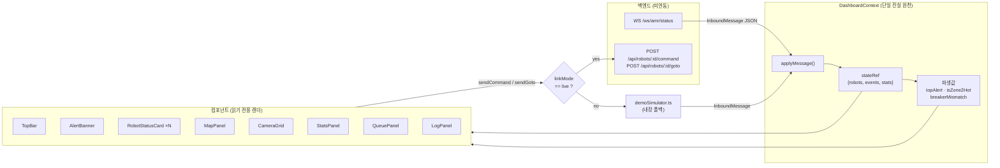
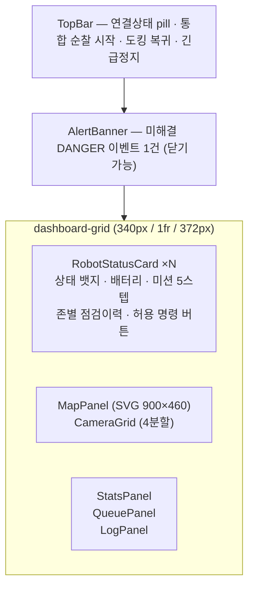

# [FE] 설비 안전 AMR 순찰·이상감지 관제 Web HMI

> 브랜치 `feature/frontend` → `main` · 커밋 `b07aaca feat: frontend Web UI`
> 신규 파일 37개 / +3,711줄 (`package-lock.json` 1,742줄 제외 시 실코드 약 1,969줄)

---

## 1. 요약

단일 HTML 파일(`index_1.html`)로 만들어져 있던 관제 대시보드 프로토타입을
**Vite + React 18 + TypeScript** 구조로 전환했습니다.

- 백엔드가 없어도 화면 전체가 동작합니다 (내장 데모 시뮬레이터 폴백).
- 로봇 상태 · 명령 가능 여부 · 미션 스텝을 **상수 테이블 3개**(`STATE_META` / `TRACKS` / `ALLOWED`)로 중앙 관리합니다.
- 화면 상태의 단일 진실 원천(single source of truth)은 `DashboardContext` 하나이며,
  컴포넌트는 **그리기만** 하고 상태를 직접 바꾸지 않습니다.

이 PR은 **UI 레이어 전체**를 담고 있고, 실제 백엔드 연동은 아직 되지 않은 상태입니다
(§7의 연동 계약과 §8의 리뷰 포인트를 함께 봐 주세요).

---

## 2. 변경 범위

```
hmi/frontend/
├─ index.html, package.json, vite.config.ts, tsconfig*.json, .env.example, .gitignore
├─ README_KO.md
└─ src/
   ├─ main.tsx, App.tsx
   ├─ components/   (8개 · 각 .tsx + .css)
   ├─ constants/dashboard.ts     102줄  ← 상태/스텝/명령 정의
   ├─ context/DashboardContext.tsx 346줄 ← 상태 저장소 + WS + 명령 전송
   ├─ hooks/useDashboard.ts
   ├─ lib/apiClient.ts, demoSimulator.ts (266줄)
   ├─ styles/tokens.css, global.css
   ├─ types/index.ts             124줄
   └─ utils/robot.ts
```

`dist/`와 `.env`는 `.gitignore` 처리되어 **커밋에 포함되지 않았습니다.** (확인 완료)
루트에는 아무 파일도 추가하지 않았고, 기존 `src/`(ROS2 패키지 영역)는 건드리지 않았습니다.

---

## 3. 아키텍처 — 데이터 흐름



**핵심 규칙: 낙관적 업데이트 금지.**
버튼을 눌러도 화면 상태를 미리 바꾸지 않습니다. `pending`에 "요청 중…"만 표시하고,
서버(또는 데모)가 **새 상태를 되돌려줄 때만** 화면이 바뀝니다. 실제 로봇과 화면이 어긋나는 사고를 막기 위한 의도적인 설계입니다.

---

## 4. 화면 구성



| 컴포넌트 | 역할 | 데이터 출처 |
|---|---|---|
| `TopBar` | WS 연결 상태 표시, 전체 로봇 일괄 명령 | `linkMode`, `startAll/dockAll/estopAll` |
| `AlertBanner` | 미해결 `DANGER` 이벤트 상단 고정 배너 | `topAlert` |
| `RobotStatusCard` | 로봇 1대 = 카드 1장. 상태·배터리·미션 스텝·명령 버튼 | `robot`, `ALLOWED`, `TRACKS` |
| `MapPanel` | 시설 맵 SVG, 로봇 pose 실시간, **클릭 → 이동 목표 전송** | `robots[].pose`, `sendGoto` |
| `CameraGrid` | CCTV 2 + AMR 캠 2, 바운딩박스/이상감지 전환 | `isZone2Hot` (※ 현재 전부 하드코딩 목업) |
| `StatsPanel` | 화재/연기·누수 누적, 차단기 불일치 현재값 | `stats`, `breakerMismatch` |
| `QueuePanel` | 이벤트 큐 최신 6건 | `events` |
| `LogPanel` | PC1/PC2/Fleet 태그별 활동 로그 최신 40건 | `logs` |

---

## 5. 상태·명령 규격 (`src/constants/dashboard.ts`)

로봇 상태 16종. **상태별로 허용된 명령만 버튼으로 렌더**되며, 불가능한 명령은 아예 화면에 나타나지 않습니다.

| 상태 | 라벨 | 톤 | 허용 명령 |
|---|---|---|---|
| `OFFLINE` | 연결 끊김 | off | — |
| `MAPPING` | 맵 생성 중 | info | estop |
| `IDLE` | 대기 | idle | start, dock |
| `UNDOCKING` | 출발 준비 | info | estop |
| `PATROLLING` | 순찰 중 | ok | pause, estop, dock |
| `PATROL_PAUSED` | 순찰 일시정지 | warn | resume, estop, dock |
| `DISPATCHING` | 이상지점 이동 중 | warn | estop |
| `INSPECTING` | 점검 중 | info | pause, estop |
| `ALERTING` | 현장 경보 중 | danger | ack, estop |
| `REPORTING` | 결과 전송 중 | info | estop |
| `RESUMING` | 순찰 복귀 중 | info | pause, estop |
| `DOCKING` | 도킹 중 | idle | estop |
| `CHARGING` | 충전 중 | idle | start |
| `EMERGENCY_STOP` | 긴급정지 | danger | reset |
| `ERROR` | 오류 | danger | reset |
| `ASSIGNED` | 배정됨 | warn | estop |

`ALLOWED`는 `Record<RobotState, Command[]>` 타입이라 **상태를 새로 추가하면 컴파일이 깨집니다.** (의도된 안전장치)

### 미션 트랙 (카드의 5스텝은 이 표에서만 나옵니다)

| | PATROL 🛡 순찰 미션 | ANOMALY 🚨 이상 대응 미션 |
|---|---|---|
| 1 | 순찰 시작 `UNDOCKING` | 이벤트 접수 `ASSIGNED` |
| 2 | 경로 주행 `PATROLLING` | 현장 출동 `DISPATCHING` |
| 3 | 존 차단기 점검 `INSPECTING` | 현장 확인 `INSPECTING` |
| 4 | 다음 구역 이동 `PATROLLING` | 경보 발령 `ALERTING` 🔊 |
| 5 | 순찰 완료 `DOCKING/CHARGING/IDLE` | 보고·순찰 복귀 `REPORTING/RESUMING` |

서버가 `step`을 안 주면 `utils/robot.ts:stepIndex()`가 현재 `state`로 트랙 위치를 역추정합니다.

---

## 6. 로컬 실행

```bash
cd hmi/frontend && npm install && npm run dev
```

개발 서버 포트는 **5175** (`vite.config.ts`, `host: true`라 같은 네트워크의 다른 PC에서도 접속 가능).

```bash
cd hmi/frontend && npm run build
```

`build`는 `tsc --noEmit && vite build`라 **타입 에러가 있으면 빌드가 실패**합니다.

`.env.example`을 `.env`로 복사해서 씁니다.

| 변수 | 기본값 | 설명 |
|---|---|---|
| `VITE_MOCK` | `true` | `true`면 WS 시도 없이 바로 데모 시뮬레이터 구동 |
| `VITE_API_BASE` | `http://localhost:8001` | REST 베이스 URL |
| `VITE_WS_URL` | `ws://localhost:8001/ws/amr/status` | 상태 스트림 WS |

> ⚠️ 이 PR에서는 `npm install`을 하지 않아 **타입체크/빌드를 실행 검증하지 못했습니다.**
> 리뷰어 중 한 명이 `npm run build`를 한 번 돌려 주시면 좋겠습니다.

---

## 7. 백엔드 연동 계약 (⚠️ 합의 필요)

### 인바운드 — WS 프레임 (`types/index.ts:InboundMessage`)

```jsonc
{
  "robots": [{ "id": "AMR-01", "state": "PATROLLING", "battery": 78, "pose": {"x":250,"y":145}, "ts": "..." }],
  "events": [{ "id": "EVT-0142", "severity": "DANGER", "state": "ASSIGNED", "text": "...", "zone": "존-2", "ts": "..." }],
  "stats":  { "fire": 1, "leak": 0 },
  "log":    { "tag": "PC2", "msg": "...", "hot": true }
}
```

- 네 필드 모두 optional. `robots`는 **부분 갱신(patch)** 으로 병합됩니다.
- `events`는 patch가 아니라 **전체 배열 교체**입니다. (서버가 매번 전체 큐를 보내야 함)
- `ts`는 epoch(number) / ISO 문자열(string) 둘 다 허용.

### 아웃바운드 — REST

| 동작 | 요청 |
|---|---|
| 명령 전송 | `POST /api/robots/{id}/command` · `{ "cmd": "start\|pause\|resume\|dock\|estop\|reset\|ack" }` |
| 이동 목표 | `POST /api/robots/{id}/goto` · `{ "waypoints": [{"x":..,"y":..}], "preempt": true }` |

### 🔴 알려진 규격 불일치

프론트가 쓰는 값이 기존 API v1.0 논의 내용과 다릅니다. **머지 전 또는 직후 반드시 재조율이 필요합니다.**

| 항목 | 이 PR (프론트) | 백엔드 API v1.0 |
|---|---|---|
| 로봇 ID | `AMR-01`, `AMR-02` | `carter1`, `carter2` |
| 미션 진행 단계 | 5스텝 (`TRACKS`) | 6단계 `progress_step` |
| 존 식별자 | `"존-1"`, `"존-2"`, `"존-3"` (한글 문자열) | 미정 |

> 참고: `README_KO.md`가 `docs/fe-be-연동규격.md`를 참조하지만 **이 저장소에는 해당 문서가 없습니다.**
> 규격 문서를 이 레포에 올릴지, 링크로 대체할지 정해 주세요.

---

## 8. 리뷰 포인트 / 알려진 이슈

머지를 막을 정도는 아니지만, **실연동 전에 반드시 정리하고 가야 하는 항목**들입니다.
읽으면서 발견한 순서가 아니라 영향도 순으로 정렬했습니다.

### 🔴 실연동 시 문제가 되는 것

**① WS 폴백 후에도 재연결 루프가 계속 돌고, 연결되면 데모와 실데이터가 동시에 들어옵니다**
`DashboardContext.tsx:160-205` — WS 타임아웃(1.5초) 시 `startDemo()`로 폴백하는데,
그 직후 발생하는 `ws.onclose`가 `settled === true` 분기를 타서 `linkMode`를 `"down"`으로 덮어씁니다.
결과적으로 (a) 데모가 도는데 상단 pill은 "데모 모드"가 아니라 **"WS 끊김 · 재연결"** 로 표시되고,
(b) 2초마다 재연결을 계속 시도하며, (c) 나중에 WS가 실제로 열리면 **데모 시뮬레이터가 멈추지 않은 채**
실데이터와 함께 `applyMessage`를 호출합니다. 폴백 시 `demoRef.current?.stop()`과 재연결 중단이 필요합니다.

**② `pending`("요청 중…")이 다음 텔레메트리 프레임에서 무조건 지워집니다**
`DashboardContext.tsx:117-122` — 해당 로봇의 patch가 오기만 하면 상태 변화 여부와 무관하게 pending을 해제합니다.
데모는 1.2초, 실서버는 그보다 더 자주 텔레메트리를 보낼 테니 **"명령이 반영될 때까지 기다린다"는 §3의 설계 의도가 무력화**됩니다.
`prevRobot.state !== merged.state`일 때만 해제하거나, 명령별 `request_id`를 서버가 에코하는 방식이 필요합니다.

**③ HTTP 실패가 조용히 삼켜집니다**
`lib/apiClient.ts:11-19` — `fetch` 예외를 `catch`해서 `null`을 반환하고, `response.ok`도 검사하지 않습니다.
따라서 `sendCommand`의 `catch`는 **절대 실행되지 않고**, 500이든 네트워크 단절이든 5초 타임아웃 후
"명령 응답 지연"만 뜹니다. 상태코드 검사 + 에러 전파가 필요합니다.

**④ 첫 프레임이 부분 patch면 런타임 크래시 가능성**
`DashboardContext.tsx:97-101`에서 `{...prevRobot, ...patch} as Robot`으로 캐스팅하는데,
`prevRobot`이 없고 patch에 `mission_type`이 빠져 있으면 `RobotStatusCard.tsx:12`의 `TRACKS[undefined].icon`에서 TypeError가 납니다.
`STATE_META`는 `?? fallback`이 있는데 `TRACKS`에는 없습니다. **서버가 로봇당 첫 프레임은 반드시 full snapshot으로 보낸다**는
합의가 필요하고, 프론트에도 방어 코드를 넣는 편이 안전합니다.

### 🟡 논의하고 싶은 설계 결정

**⑤ `stateRef` + 버전 카운터 패턴** (`DashboardContext.tsx:37-41`)
로봇/이벤트/통계를 `useRef`에 담고 `useReducer` 카운터로만 리렌더를 유발합니다.
잦은 텔레메트리에서 리렌더를 제어하려는 의도는 이해하지만 React의 렌더링 모델을 우회하는 방식이라,
동시성 기능(transition 등)을 쓰기 시작하면 tearing 위험이 있습니다. 그냥 `useReducer`로 정직하게 가는 게 나을지 의견 부탁드립니다.
관련해서 context `value` 객체가 memo되지 않아(`:317`) `now` 1초 틱마다 전체 트리가 리렌더됩니다 — 지금 규모에선 문제없지만 로봇 수가 늘면 재검토 필요.

**⑥ `estopAll`만 `ALLOWED` 검사를 건너뜁니다** (`:296-298`)
`startAll`/`dockAll`은 허용 상태만 골라 보내는데 `estopAll`은 `OFFLINE` 로봇에도 전송합니다.
긴급정지는 무조건 나가야 한다는 의도로 보이는데, 맞다면 주석 한 줄 남겨 주세요.

**⑦ `"존-2"` 문자열이 로직에 하드코딩되어 있습니다** (`:310-312`, `CameraGrid.tsx:31,49`)
`isZone2Hot`이 한글 문자열 `"존-2"`와 정확히 일치할 때만 참입니다. 데모 시나리오 전용 코드가 컨텍스트 로직에 들어와 있는 형태라,
존 ID 규격이 정해지면 이벤트 → 카메라/맵 매핑을 데이터 기반으로 바꿔야 합니다.

### 🟢 목업 / 후속 작업

- **`CameraGrid`는 100% 하드코딩된 가짜 피드**입니다 (CSS 그라디언트 + 고정 바운딩박스 좌표, 실제 스트림 없음). 실제 영상/추론 결과 연동 필요.
- **맵 확대/축소/현재위치/레이어 버튼 4개가 동작하지 않습니다** (`MapPanel.tsx:132-137`, `onClick` 없음). 구현하거나 일단 숨기는 편이 낫습니다.
- **맵 SVG가 키보드로 접근 불가**합니다. `role="img"`에 `onClick`만 달려 있어 마우스 없이는 이동 목표를 지정할 수 없습니다.
  (좌표 변환 자체는 `height: auto`로 종횡비가 보존되어 정상 동작합니다. 다만 나중에 캔버스에 고정 높이를 주면 좌표가 어긋나므로 `getScreenCTM()` 방식이 더 안전합니다.)
- **ESLint / Prettier 설정과 테스트가 없습니다.** 팀 컨벤션을 정해 별도 PR로 추가 제안합니다.
- **`README_KO.md`에 작성자 로컬 절대경로가 들어 있습니다**
  (`C:\Users\user\Desktop\취준생\...`). 공유 레포에는 맞지 않으니 상대경로 안내로 교체 제안합니다.
- `dismissedAlertId`가 단일 값이라 배너를 닫은 뒤 다른 알림이 해소되면 이전 알림이 다시 뜰 수 있습니다 (경미).

---

## 9. 리뷰어 체크리스트

- [ ] `npm install && npm run build` 통과 확인
- [ ] `VITE_MOCK=true`로 데모 시나리오 확인 (12틱째 존-2 연기 감지 → AMR-02가 ANOMALY 미션으로 전환되는지)
- [ ] 맵 클릭 → 로봇 선택 → 전송 동작 확인
- [ ] 로봇 ID / progress_step 규격(§7) 백엔드와 합의
- [ ] 🔴 항목 ①~④ 중 이번 PR에서 고칠 것 / 후속 PR로 뺄 것 결정

---

## 10. 다음 단계 제안

1. 규격 합의 (§7) → `types/index.ts`·`constants/dashboard.ts` 수정
2. 🔴 ①~④ 수정
3. 실 WS 연동 후 `demoSimulator.ts` 분기 제거 (파일 상단 주석대로 통째로 삭제 가능하게 설계되어 있음)
4. 카메라 실피드 + YOLO 추론 결과 오버레이 연동
5. ESLint/Prettier + 최소 단위 테스트 도입
